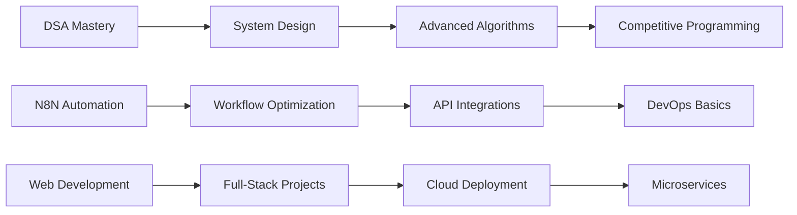

# 👋 Hey there! I'm Dev Lahrani

```ascii
╔══════════════════════════════════════════════════════════════╗
║  ____             _        _    _                  _         ║
║ |  _ \  _____   __| |      | |  | |_   _ _ __   ___| |        ║
║ | | | |/ _ \ \ / /| |      | |__| | | | | '_ \ / _ \ |        ║
║ | |_| |  __/\ V / | |___   |  __  | |_| | | | |  __/_|        ║
║ |____/ \___| \_/  |_____|  |_|  |_|\__,_|_| |_|\___(_)        ║
║                                                              ║
║           🚀 Building the future, one commit at a time       ║
╚══════════════════════════════════════════════════════════════╝
```

<div align="center">
  
[](https://git.io/typing-svg)

</div>

---

## 🧑‍💻 About Me

```python
class DevLahrani:
    def __init__(self):
        self.name = "Dev Lahrani"
        self.location = "Pune, India"
        self.education = "SY Student @ VIT Pune"
        self.current_focus = ["Data Structures & Algorithms", "N8N Automation", "Web Development"]
        self.languages = ["Python", "C++", "JavaScript", "HTML/CSS"]
        self.hobbies = ["Swimming 🏊‍♂️", "Reading Web Novels 📚", "MTL Translations 🌐"]
        self.coffee_consumed = "∞"
    
    def say_hi(self):
        return "Thanks for dropping by! Let's build something amazing together! 🚀"

dev = DevLahrani()
print(dev.say_hi())
```

---

## 🛠️ Tech Stack & Tools

<div align="center">

### Languages


### Frameworks & Tools


### Currently Learning


</div>

---

## 🚀 Featured Projects

<div align="center">

| Project | Description | Tech Stack | Status |
|---------|-------------|------------|---------|
| 🤖 [NeuroAssist](https://github.com/DakshVDharmani/neuroassist) | AI-powered assistance tool | Python, ML | 🔥 Active |
| 🍕 [Restaurant Website](https://github.com/Dev-Lahrani/Resturent-Website) | Full-stack restaurant management | HTML, CSS, JS | ✅ Complete |
| 💬 [Chat-Box](https://github.com/Dev-Lahrani/Chat-Box) | Real-time messaging application | JavaScript, WebSocket | ✅ Complete |
| ✈️ [Aviation Blog](https://github.com/Dev-Lahrani/aviation-blog-website) | Aviation enthusiast blog platform | Web Technologies | ✅ Complete |
| 🔐 [Crypto Collaborative Editor](https://github.com/Dev-Lahrani/Collaborative-Editing-using-Cryptography-and-blockchain) | Secure collaborative editing | Blockchain, Crypto | 🚧 In Progress |
| 🌐 [Portfolio Website](https://github.com/Dev-Lahrani/Resume-Website) | Personal portfolio showcase | Frontend | ✅ Complete |

</div>

---

## 📊 GitHub Analytics

<div align="center">


</div>

---

## 🎯 Current Goals & Learning Path



---

## 🏆 Achievements & Highlights

<div align="center">

| 🎖️ Achievement | 📅 Year | 💡 Description |
|----------------|---------|----------------|
| 🏊‍♂️ Swimming Enthusiast | 2024 | Balancing code and cardio |
| 📚 Novel Reader | Ongoing | 100+ web novels and counting |
| 🚀 GitHub Repos | 2024 | 10+ active repositories |
| 🎓 VIT Student | Current | Computer Science Journey |
| 🤝 Hackathon Participant | 2024 | NMIT Hackathon Contributor |

</div>

---

## 🌟 Fun Facts About Me

<div align="center">

```
🏊‍♂️ I swim to debug my thoughts (and my code)
📖 I've probably read more web novels than documentation
🌏 MTL novels help me understand different perspectives (and languages!)
☕ My code quality is directly proportional to my caffeine intake
🔧 I automate everything with N8N because I'm efficiently lazy
🎯 Currently solving DSA problems like they're plot twists in novels
```

</div>

---

## 📫 Let's Connect!

<div align="center">

[](https://linkedin.com/in/dev-lahrani)
[](https://twitter.com/dev_lahrani)
[](mailto:dev.lahrani@example.com)
[](https://dev-lahrani.github.io)

### 💭 *"Code is like humor. When you have to explain it, it's bad." - Cory House*

</div>

---

<div align="center">
  

[](https://github.com/Dev-Lahrani)

**Thanks for visiting my profile! Don't forget to ⭐ repositories you find interesting!**

</div>

---

<div align="center">

```
╔════════════════════════════════════════════════════════════════════╗
║  "The best way to predict the future is to invent it." - Alan Kay  ║
║                                                                    ║
║                    Happy Coding! 🚀✨                             ║
╚════════════════════════════════════════════════════════════════════╝
```

</div>
