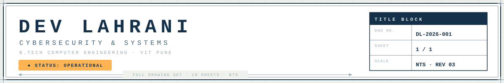
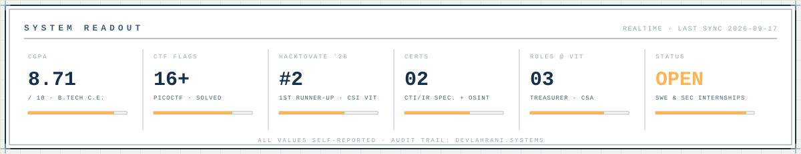
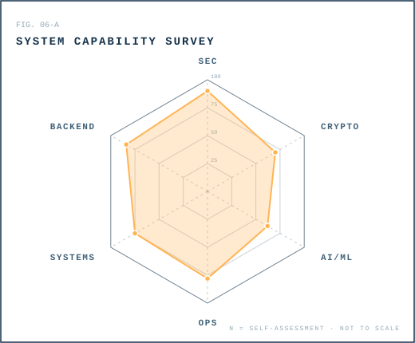
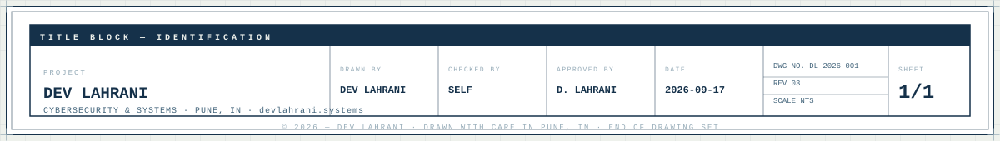

<div align="center">

<picture>
  <source media="(prefers-color-scheme: dark)" srcset="assets/banner-dark.svg">
  
</picture>

<br/>

[](https://in.linkedin.com/in/dev-lahrani-788520358)
[](https://devlahrani.systems)
[](https://devlahrani.systems/Dev%20Lahrani%20Resume.pdf)
[](mailto:devlahrani10@gmail.com)

<sub><samp>SET OF 10 DRAWING SHEETS · REVISION 03 · PUNE, IN · DRAWN TO NO SCALE</samp></sub>

</div>

---

### SHEET 01 — STATUS

<div align="center">

<picture>
  <source media="(prefers-color-scheme: dark)" srcset="assets/status-dark.svg">
  
</picture>

</div>

### SHEET 02 — INDEX

| Sheet | Contents | Sheet | Contents |
|:---:|---|:---:|---|
| **01** | [Status readout](#sheet-01--status) | **06** | [Credentials](#sheet-06--credentials) |
| **02** | Index — you are here | **07** | [CTF registry](#sheet-07--ctf-registry) |
| **03** | [Specifications](#sheet-03--specifications) | **08** | [Awards & roles](#sheet-08--awards--roles) |
| **04** | [Projects](#sheet-04--projects) | **09** | [Transmission](#sheet-09--transmission) |
| **05** | [Capability survey](#sheet-05--capability-survey) | **10** | [Revision history](#sheet-10--revision-history) |

### SHEET 03 — SPECIFICATIONS

```yaml
unit:
  designation: "Dev Lahrani"
  class:       "Cybersecurity & Systems"
  program:     "B.Tech Computer Engineering — VIT Pune (2024–'28)"
  cgpa:        8.71 / 10

current_load:
  - building: "threshold-crypto editor — pushing toward production"
  - learning: "pentest fundamentals · DSA in C++ · Rust for systems"
  - reading:  "security engineering papers & CTF write-ups"
  - seeking:  "SWE & security internships — summer/winter 2026"

operating_principle: "Automation over repetition. Detection over reaction."
```

### SHEET 04 — PROJECTS

| No. | Drawing | Specification | Stack | Source |
|:---:|---|---|---|:---:|
| 01 | **Threshold Crypto Editor** | Real-time collaborative editor where updates land only when a quorum cooperates — threshold signatures over WebSockets; no single client can forge a change | `TypeScript` `Node.js` `Crypto` | [↗ site](https://devlahrani.systems) |
| 02 | **SeeTheScience** | AI science-learning platform: plain-English prompt → interactive physics/chemistry simulations. Built at HACKtoVATE 2026 | `JS` `LLM APIs` `Simulation` | [↗ site](https://devlahrani.systems) |
| 03 | **Live Disaster Tracker** | Real-time disaster/weather/AQI monitoring with live map filters, trend analytics & a Three.js 3D globe | `React` `Vite` `Three.js` | [↗ site](https://devlahrani.systems) |
| 04 | **Veli-Chat** | Two-party, E2E-encrypted, serverless terminal chat over Tor with zero persistence | `TypeScript` `Tor` | [↗ repo](https://github.com/Dev-Lahrani/Veli-Chat) |
| 05 | **Polar Ops Digital Twin** | Digital-twin operations console | `TypeScript` | [↗ repo](https://github.com/Dev-Lahrani/polar-ops-digital-twin) |
| 06 | **Magni** | Systems utility build | `Python` | [↗ repo](https://github.com/Dev-Lahrani/Magni) |

<sub><samp>NOTE 04-A · drawings 01–03 are private / live on the portfolio — verify at devlahrani.systems</samp></sub>

### SHEET 05 — CAPABILITY SURVEY

<table>
<tr>
<td width="46%" valign="top">

<picture>
  <source media="(prefers-color-scheme: dark)" srcset="assets/radar-dark.svg">
  
</picture>

</td>
<td width="54%" valign="top">

#### BILL OF MATERIALS

| Ref | Category | Components |
|:---:|---|---|
| A | Languages | `C++` `C` `Python` `TypeScript` `Bash` `SQL` |
| B | Core CS | `DSA` `OOP` `OS` `DBMS` `Network Security` |
| C | Tools | `Git` `Linux` `Node.js` `React` `Flask` `OpenCV` `MQTT` |
| D | Security | `Wireshark` `Burp Suite` `Kali` `Cryptography` `ESP32` `Raspberry Pi` |

<sub><samp>TOL ±1 SELF-ASSESSMENT · CALIBRATION PENDING INDUSTRY EXPOSURE</samp></sub>

</td>
</tr>
</table>

### SHEET 06 — CREDENTIALS

| Credential | Issuer | Date | Verified |
|---|---|---|:---:|
| **CTI & Incident Response** — 3-course specialization: threat intel frameworks, vulnerability assessment, incident response | Edureka · Coursera | Aug 2026 | [↗ verify](https://coursera.org/verify/specialization/P4GZSL2NV99A) |
| **The OSINT Handbook** — collecting, correlating & validating open-source intelligence | Packt · Coursera | Aug 2026 | [↗ verify](https://coursera.org/verify/HDWI9AJDDJIV) |

| Year | Institution | Program | Reading |
|---|---|---|:---:|
| 2024–'28 | Vishwakarma Institute of Technology, Pune | B.Tech · Computer Engineering | `8.71 CGPA` |
| 2024 | SNBP School, Morwadi | Class XII · HSC | `72%` |
| 2022 | Blossom Public School | Class X · SSC | `82%` |

### SHEET 07 — CTF REGISTRY

<div align="center">


</div>

| # | Challenge | Method | Tags |
|:---:|---|---|---|
| 01 | Text Transformations | chained decoding — `base64 -d` → `rev` → `tr` → ROT13 | `reversing` `linux` |
| 02 | MyGit | commit-authorship impersonation over SSH — supply-chain trust | `git` `supply-chain` |
| 03 | BYTEMANCY-1 | ASCII 101 × 1751 transmissions via `python3 -c \| nc` | `python` `netcat` |
| 04 | SMB Share Access | guest-access share enumeration & flag retrieval via `smbclient` | `smb` `enum` |
| 05 | Command Injection | unsanitized metacharacters in ping → `; ls` → `; cat flag.txt` | `injection` `rce` |
| 06 | BYTEMANCY-0 | ASCII 101 × 3 — `print('\x65\x65\x65')` over netcat | `python` `netcat` |

<sub><samp>NOTE 07-A · flags are not reproduced here; full methodology & step-by-step write-ups live at devlahrani.systems</samp></sub>

### SHEET 08 — AWARDS & ROLES

**AWARDS**

> **1st Runner Up — HACKtoVATE · CodeFlix 2026** `MAR 2026`
> Built *SeeTheScience* in a 24-hour window. Organized by the Computer Society of India, VIT Pune.

**ROLES**

| Role | Unit | Term |
|---|---|---|
| Treasurer | Computer Student Association, VIT Pune | Jun 2025 — Jun 2026 |
| Content Lead | Speakers Club, VIT Pune | Jun 2025 — Mar 2026 |
| Organizer | CodeVerse 2026 · CSA, VIT Pune | Mar 2026 |

### SHEET 09 — TRANSMISSION

<div align="center">

| Channel | Address |
|:---:|---|
| **EMAIL** | [`devlahrani10@gmail.com`](mailto:devlahrani10@gmail.com) |
| **LINKEDIN** | [`in/dev-lahrani`](https://in.linkedin.com/in/dev-lahrani-788520358) |
| **PORTFOLIO** | [`devlahrani.systems`](https://devlahrani.systems) |
| **RESUME** | [`download PDF`](https://devlahrani.systems/Dev%20Lahrani%20Resume.pdf) |

<br/>

<sub><samp>RESPONSE TIME &lt; 24H · PUNE, IN (UTC+5:30) · OPEN TO RELOCATION FOR THE RIGHT MISSION</samp></sub>

</div>

### SHEET 10 — REVISION HISTORY

<details>
<summary><samp>› deployment log — click to expand</samp></summary>

```text
REV 03  2026-09  drawing-set profile redesign (this document)
REV 02  2026-08  CTI/IR specialization + OSINT handbook certified
REV 01  2026-03  HACKtoVATE '26 · 1st runner-up shipped
        2026     Veli-Chat · polar-ops-digital-twin · Magni released
REV 00  2025     picoCTF campaign — 16+ flags · portfolio v1 live
```

</details>

---

### APPENDIX — LIVE TELEMETRY

<div align="center">

<details open>
<summary><samp>› contribution grid — auto-drawn daily by GitHub Actions</samp></summary>
<br/>

</details>

<br/>

<details>
<summary><samp>› detailed metrics — lowlighter/metrics · refreshed nightly</samp></summary>
<br/>

</details>

</div>

<sub><samp>APPENDIX MAINTENANCE · .github/workflows/snake.yml & metrics.yml regenerate the above at 00:00 UTC daily</samp></sub>

<div align="center">

<picture>
  <source media="(prefers-color-scheme: dark)" srcset="assets/footer-dark.svg">
  
</picture>

</div>
